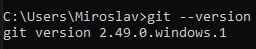
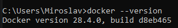
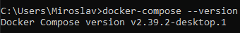

# Practical Work 2, 3, 4

## Completed actions:

### 1. Software Installation
- Git installed
- Docker installed  
- Docker Compose installed

### 2. Nginx Work
- Nginx container launched
- Main page content replaced with "GRGU"

### 3. Screenshots
- Screenshots of installed software versions attached

### 4. Git Work
- README.md file created
- Changes saved in develop branch
- Changes uploaded to remote server
## Screenshots of installed software versions:

### Git Version

### Docker Version

### Docker Compose Version

### Running a container with Nginx

### Check in the browser: http://localhost:8080
